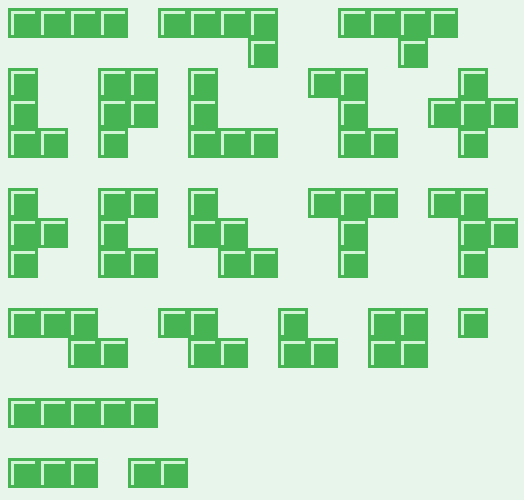
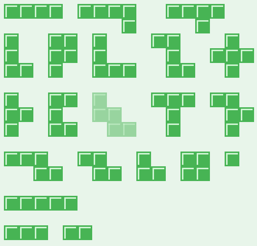

# blokee
Blokee (Blokus)

## step01


```processing
//Blokee vs. Blokus
//https://blokee.mattle.online/lobby/forum/topic/Z2bJJGnhgLqLRxKMm/blokus-game-rules
//https://zh.wikipedia.org/wiki/角鬥士棋
//21 pieces: 1,2,3,3v,4I,4L,4Z,4O,4T,F,I,L,N,P,T,U,V,W,X,Y,Z
//Q:如何旋轉？
//https://www.facebook.com/groups/ViewSonicClassroomTaiwan/posts/1667693336918418/
//三師爸 (但文章好像刪掉了）
//https://www.facebook.com/三師爸Sense-Bar-108066560626981


color c[]={#47B454, #D0F5D4, #E8F5EA};
void setup(){
  size(524,500);
}
void draw(){
  background(c[2]);
  for(int i=0; i<table.length;i++){
    for(int j=0; j<table[i].length;j++){
      if(table[i][j]==1) cubeOne(i,j);
    }
  }
}
char [][] table = { //16x17
  {1,1,1,1,0,1,1,1,1,0,0,1,1,1,1,0,0},
  {0,0,0,0,0,0,0,0,1,0,0,0,0,1,0,0,0},
  {1,0,0,1,1,0,1,0,0,0,1,1,0,0,0,1,0},
  {1,0,0,1,1,0,1,0,0,0,0,1,0,0,1,1,1},
  {1,1,0,1,0,0,1,1,1,0,0,1,1,0,0,1,0},
  {0,0,0,0,0,0,0,0,0,0,0,0,0,0,0,0,0},
  {1,0,0,1,1,0,1,0,0,0,1,1,1,0,1,1,0},
  {1,1,0,1,0,0,1,1,0,0,0,1,0,0,0,1,1},
  {1,0,0,1,1,0,0,1,1,0,0,1,0,0,0,1,0},
  {0,0,0,0,0,0,0,0,0,0,0,0,0,0,0,0,0},
  {1,1,1,0,0,1,1,0,0,1,0,0,1,1,0,1,0},
  {0,0,1,1,0,0,1,1,0,1,1,0,1,1,0,0,0},
  {0,0,0,0,0,0,0,0,0,0,0,0,0,0,0,0,0},
  {1,1,1,1,1,0,0,0,0,0,0,0,0,0,0,0,0},
  {0,0,0,0,0,0,0,0,0,0,0,0,0,0,0,0,0},
  {1,1,1,0,1,1,0,0,0,0,0,0,0,0,0,0,0},
};
void cubeOne(int i, int j){
  int dx=8,dy=dx,w=30,L2=w/8,L=w-L2-L2;
  fill(c[0]);
  noStroke();
  rect(dx+j*w,dy+i*w,w,w);
  fill(c[1]);
  rect(dx+j*w+L2,dy+i*w+L2,L,L2);
  rect(dx+j*w+L2,dy+i*w+L2,L2,L);
}
```

## step02


```processing
//Blokee vs. Blokus
//https://blokee.mattle.online/lobby/forum/topic/Z2bJJGnhgLqLRxKMm/blokus-game-rules
//https://zh.wikipedia.org/wiki/角鬥士棋
//21 pieces: 1,2,3,3v,4I,4L,4Z,4O,4T,F,I,L,N,P,T,U,V,W,X,Y,Z
//Q:如何旋轉？
//https://www.facebook.com/groups/ViewSonicClassroomTaiwan/posts/1667693336918418/
//三師爸 (但文章好像刪掉了）
//https://www.facebook.com/三師爸Sense-Bar-108066560626981

//TODO: 可以利用 Connected Component,讓mousePressed時，看是按到誰，將它的色彩變成2，表示淡淡的色彩，之後才能還回去放。
//接下來在 cursor 的地方，要有一個半透明的piece可跟著移動。
//如果在不能放的地方，就會做旋轉/翻面的操作。也可以有個操作區，方便做做操作。
//再開一個陣列，負責放要放的piece 的型狀，並做適當的旋轉等。

//TODO: 按下去且為One時，選取它，selecting=ture
//TODO: 如果按下去第二次（selecting==true)，可以改選另一個 or 可做旋轉/翻轉
//可以即時建立 轉動4次，翻轉再轉動4次,重覆的不要算
//旋轉時，可以用bounding box來決定旋轉中心
//TODO: 也可以選取同時，秀出全部的可能性，讓玩家再細選想要的角度
//反悔換下一片，應該是重要的 UserInterface
color c[]={#47B454, #D0F5D4, #E8F5EA};
void setup(){
  size(524,500);
}
void draw(){
  background(c[2]);
  for(int i=0; i<table.length;i++){
    for(int j=0; j<table[i].length;j++){
      if(table[i][j]==1) cubeOne(i,j,1);
      if(table[i][j]==2) cubeOne(i,j,2);
    }
  }
}
char [][] table = { //16x17
  {1,1,1,1,0,1,1,1,1,0,0,1,1,1,1,0,0},
  {0,0,0,0,0,0,0,0,1,0,0,0,0,1,0,0,0},
  {1,0,0,1,1,0,1,0,0,0,1,1,0,0,0,1,0},
  {1,0,0,1,1,0,1,0,0,0,0,1,0,0,1,1,1},
  {1,1,0,1,0,0,1,1,1,0,0,1,1,0,0,1,0},
  {0,0,0,0,0,0,0,0,0,0,0,0,0,0,0,0,0},
  {1,0,0,1,1,0,1,0,0,0,1,1,1,0,1,1,0},
  {1,1,0,1,0,0,1,1,0,0,0,1,0,0,0,1,1},
  {1,0,0,1,1,0,0,1,1,0,0,1,0,0,0,1,0},
  {0,0,0,0,0,0,0,0,0,0,0,0,0,0,0,0,0},
  {1,1,1,0,0,1,1,0,0,1,0,0,1,1,0,1,0},
  {0,0,1,1,0,0,1,1,0,1,1,0,1,1,0,0,0},
  {0,0,0,0,0,0,0,0,0,0,0,0,0,0,0,0,0},
  {1,1,1,1,1,0,0,0,0,0,0,0,0,0,0,0,0},
  {0,0,0,0,0,0,0,0,0,0,0,0,0,0,0,0,0},
  {1,1,1,0,1,1,0,0,0,0,0,0,0,0,0,0,0},
  {0,0,0,0,0,0,0,0,0,0,0,0,0,0,0,0,0}//padding for 17x17
};
int dx=8,dy=dx,w=30,L2=w/8,L=w-L2-L2;
void cubeOne(int i, int j, int type){
  fill(c[0]);
  if(type==2) fill(c[0], 128);//transparent
  noStroke();
  rect(dx+j*w,dy+i*w,w,w);
  fill(c[1]);
  if(type==2) fill(c[1], 128);//transparent
  rect(dx+j*w+L2,dy+i*w+L2,L,L2);
  rect(dx+j*w+L2,dy+i*w+L2,L2,L);
}
char [][]piece=new char[9][9];
void mousePressed(){
  int j=(mouseX-dx)/w, i=(mouseY-dy)/w;
  if(table[i][j]==1){
    findConnectedComponentAndBuildPiece(i,j);
  }
}
void findConnectedComponentAndBuildPiece(int i, int j){
  for(int ii=0; ii<9; ii++){
    for(int jj=0; jj<9; jj++){
      piece[ii][jj]=0;
    }
  }
  piece[5][5]=2;
  table[i][j]=2;
  ArrayList<Integer> I=new ArrayList<Integer>();
  ArrayList<Integer> J=new ArrayList<Integer>();
  I.add(i);
  J.add(j);
  while(I.size()>0){
    int ii=I.get(0), jj=J.get(0);
    I.remove(0); J.remove(0);
    if( insideAndOne(ii+1,jj) ){
      I.add(ii+1); J.add(jj);
      table[ii+1][jj]=2; piece[ii-i+5+1][jj-j+5]=2;
    }
    if( insideAndOne(ii,jj+1) ){
      I.add(ii); J.add(jj+1);
      table[ii][jj+1]=2; piece[ii-i+5][jj-j+5+1]=2;
    }
    if( insideAndOne(ii-1,jj) ){
      I.add(ii-1); J.add(jj);
      table[ii-1][jj]=2; piece[ii-i+5-1][jj-j+5]=2;
    }
    if( insideAndOne(ii,jj-1) ){
      I.add(ii); J.add(jj-1);
      table[ii][jj-1]=2; piece[ii-i+5][jj-j+5-1]=2;
    }
  }
}
boolean insideAndOne(int i, int j){
  if(i<0 || j>16) return false;
  if(j<0 || j>16) return false;
  if(table[i][j]==1) return true;
  return false;
}
```
